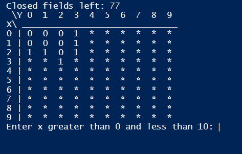
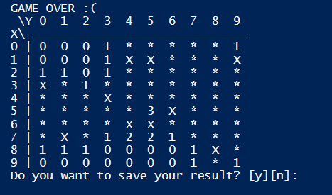

# mines
Project for powershell course zaliczenie  
Simple mini game, similar to standard minesweeper 
This is how it looks:

 

    

 
 
    
-------------------------------------------------------------------------------------------------

    

    
-------------------------------------------------------------------------------------------------

Thank you for attention
